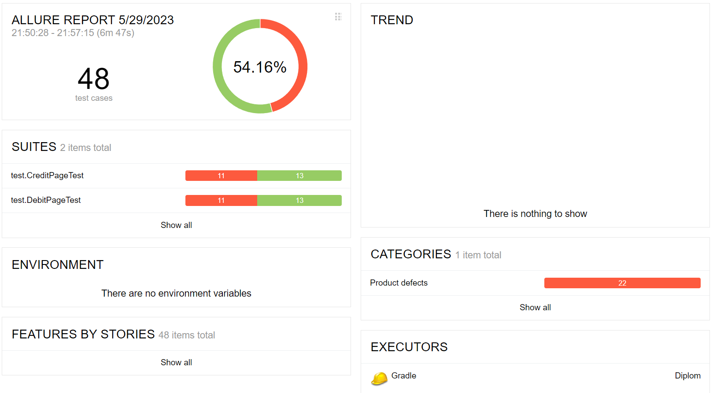
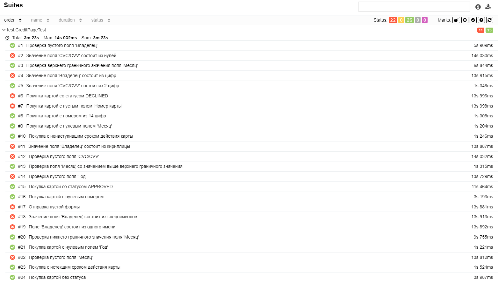
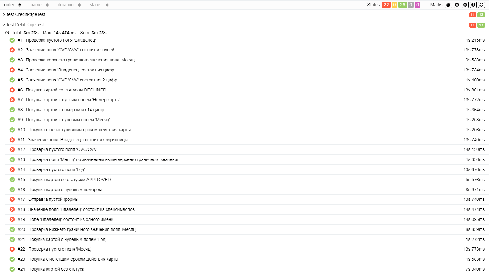

# Отчёт о проведённом тестировании
### Краткое описание
В соответствии с тест планом было проведено автоматизированное тестирование приложения "Путешествие дня". Общее количество проведенных тестов - 48.
### Количество тест-кейсов
Общее количество тест-кейсов - 48:
* Покупка дебетовой картой - 24, из них:
  - позитивные - 3;
  - негативные - 21;
* Покупка в кредит - 24, из них:
  - позитивные - 3;
  - негативные - 21.
  
Процент успешных тестов - 54.16%, не успешных тестов - 45.84%.

### Общие рекомендации
Поработать над технической документацией приложения. Более подробно описать инструкцию для настройки окружения.